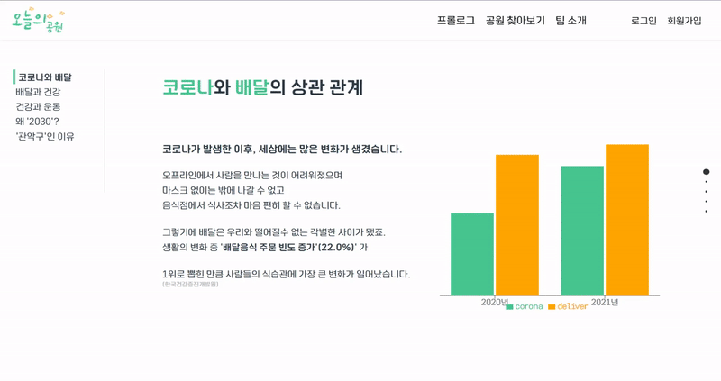
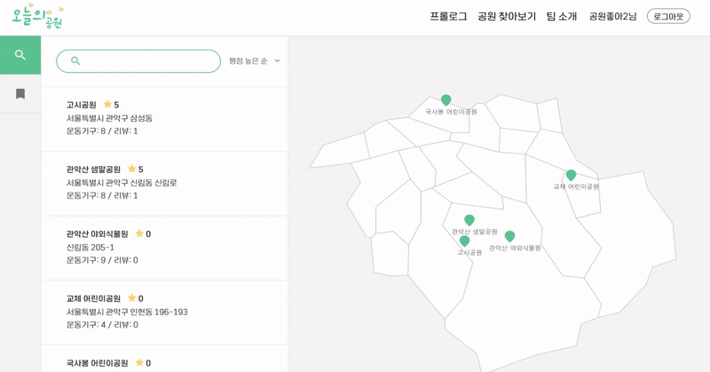
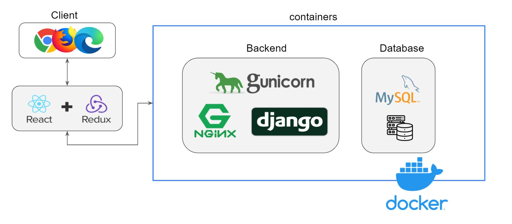

.. introduce:

=======================
프로젝트 소개
=======================

-----------------------
팀원
-----------------------

============ ============ ============= ============= ==============
|bmcho|      |myeongu|     |minyoung|    |martina|     |kwang|
============ ============ ============= ============= ==============
조병민       강면구       이민영        이영숙        양영광
데이터분석   데이터분석   프론트엔드    백엔드(팀장)  백엔드
============ ============ ============= ============= ==============
 
-----------------------
데모
-----------------------

* 발표 자료 :download:`pdf <_static/220109.pdf>`
* 소스코드: `download ZIP`_
* 백엔드: `swagger`_ \/ `redoc`_
* 프론트엔드: `demo`_ 

.. note::
    프로젝트 최종 배포는 PaaS (Heroku, Vercel)에서 진행됐습니다.

    Heroku의 `filesystem`_ 특성상 일부 기능(이미지 업로드)에 문제가 있습니다

메인 화면
-----------------------

프롤로그
-----------------------

인증
-----------------------

검색 / 리뷰
-----------------------

-----------------------
개발
-----------------------
 
기술 스택
----------------------

=============== ========================================
분류                                기술
=============== ========================================
배포                   Heroku, Vercel, Ubuntu, Docker, Docker-compose
개발                   JS, React, Python, Django, DRF
의존성 관리            yarn, poetry
백엔드                 Nginx,Gunicorn, Django
데이터베이스           MySQL
=============== ========================================

아키 텍처
----------------------

|architecture|

백엔드 개발
-----------------------

프론트엔드 개발
-----------------------

 
.. _swagger: https://today-park.herokuapp.com/swagger/
.. _redoc: https://today-park.herokuapp.com/redoc/
.. _demo: https://todaypark.vercel.app
.. _filesystem: https://devcenter.heroku.com/articles/dynos#ephemeral-filesystem
.. _Download ZIP: https://github.com/2ykwang/today-park/archive/refs/heads/develop.zip

.. |bmcho| image:: _static/member/bmcho.png 
           :target: https://github.com/bmcho
.. |kwang| image:: _static/member/kwang.png
             :target: https://github.com/2ykwang

.. |myeongu| image:: _static/member/myeongu.png 
             :target: https://github.com/myeongu 
